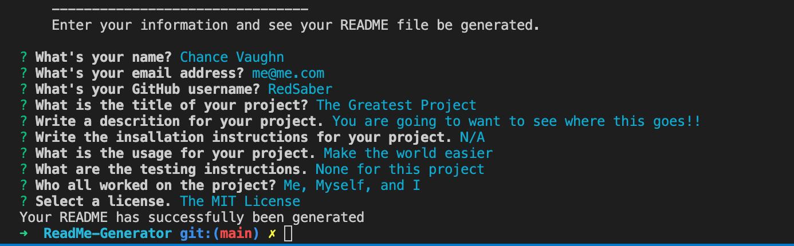
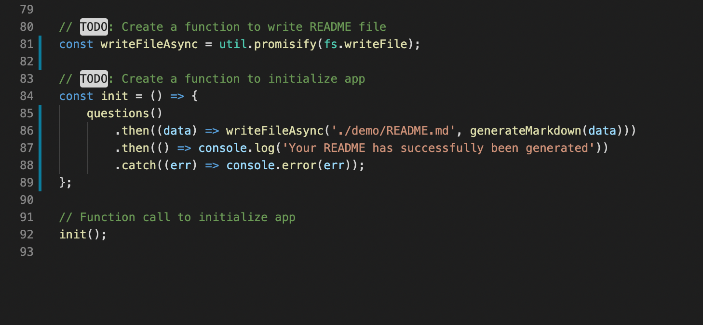

# README Generator

## Intro

Have an amazing project and are ready to make the README?

Well this is exactly what you need!

## Purpose

To have and easy and simple way to create READMEs for your projects.

## User Side

For the user, all you do is follow the questions that are presented and at the end your README will be generated for you!

## Code Magic

The code takes in all of the data that the user inputs and then gives it to another file that then generates the README based on the users inputs.

## Video Demo

https://vimeo.com/557028027

## Contributors

Chance V. Robinson

## License
 
N/A